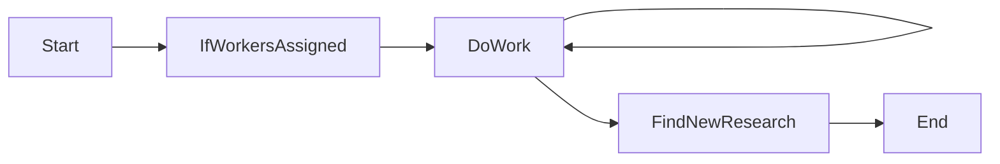
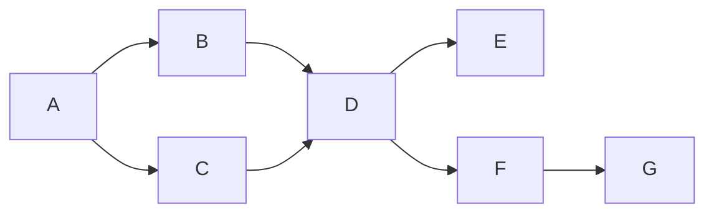

# ResearchTree

```mermaid
graph LR;
  Start;
  IfWorkersAssigned
  DoWork
  FindNewResearch
  End;
  Start-->IfWorkersAssigned;
  IfWorkersAssigned-->DoWork;
  DoWork-->DoWork
  DoWork-->FindNewResearch;
  FindNewResearch-->End;
```

```mermaid
graph LR;
    A-->B;
    A-->C;
    B-->D;
    C-->D;
    D-->E;
    D-->F-->G;
```

