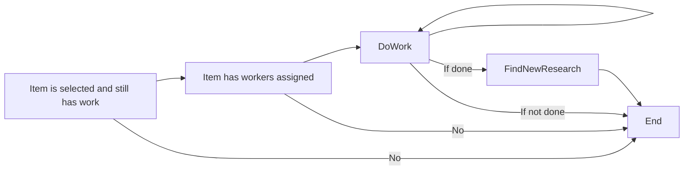
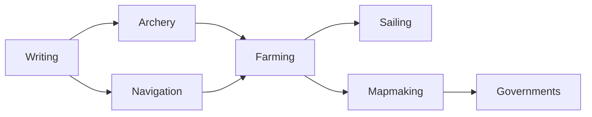
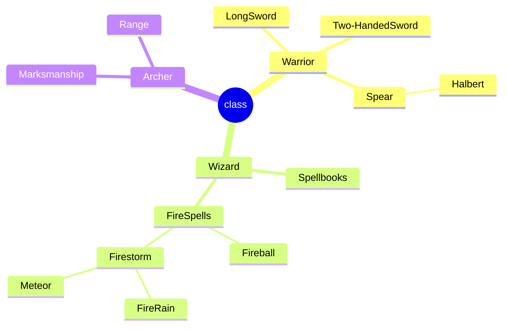

# ResearchTree

This is the research workflow

```mermaid
graph LR;
  IfItemSelected[Item is selected and still has work]
  IfWorkersAssigned[Item has workers assigned]
  DoWork
  FindNewResearch
  End
  IfItemSelected-->IfWorkersAssigned
  IfItemSelected--"No"-->End
  IfWorkersAssigned-->DoWork
  IfWorkersAssigned--"No"-->End
  DoWork-->DoWork
  DoWork--"If done"-->FindNewResearch
  DoWork--"If not done"-->End
  FindNewResearch-->End
```

Here are some research trees we want to support

```mermaid
graph LR;
    A[Writing]
    B[Archery]
    C[Navigation]
    D[Farming]
    E[Sailing]
    F[Mapmaking]
    G[Governments]
    A-->B
    A-->C
    B-->D
    C-->D
    D-->E
    D-->F-->G
```

```mermaid
mindmap
  root((class))
    Warrior
      LongSword
      Two-HandedSword
      Spear
        Halbert
    Wizard
      Spellbooks
      FireSpells
        Fireball
        Firestorm
            FireRain
            Meteor
    Archer
      Marksmanship
      Range
```
